# Telegram Message Processor for Moodle

The **Telegram Message Processor** (`message_telegram`) delivers Moodle notifications and messages directly to users' Telegram accounts in real time.

---

## 📌 System Compatibility
- **Moodle Versions:** Moodle 4.5 LTS, 5.0, 5.1, 5.2, 5.3+
- **PHP Versions:** PHP 8.2, 8.3, 8.4+
- **Database:** MySQL, MariaDB, PostgreSQL

---

## ✨ Key Features
- **Real-Time Notification Delivery:** Course announcements, assignment grades, feedback, forum replies, quiz submissions, and system alerts sent directly to Telegram.
- **Rich HTML Formatting:** Messages display bold titles, clean body text, and direct clickable **"Open in Moodle"** action links.
- **Message Length Protection:** Automatically chunks or truncates long notifications (such as daily forum digests) to respect Telegram's 4,096-character limit without delivery failures.
- **Decoupled Secure Authentication:** Account linking uses cryptographically secure 32-character tokens without exposing user session CSRF tokens (`sesskey`).
- **Multiple Easy Account Linking Methods:**
  1. **One-Click Connection Link (Classic Moodle Docs Way):** Users click "Connect with Telegram" in Moodle preferences and tap Start in Telegram.
  2. **Automatic Phone Number Matching:** Users tap one button in Telegram to share their phone number; Moodle matches it to their custom profile field automatically.
  3. **Manual Chat ID Entry:** Users find their numeric Telegram ID via `@idbot` or `@userinfobot` and paste it directly into Moodle preferences.
- **Zero-Fuss Background Polling:** Powered by Moodle's built-in scheduled background task (`\message_telegram	ask\poll_updates`) every minute — firewall-friendly and requires zero webhook or server configuration.
- **Privacy API Compliant (GDPR):** Fully implements Moodle's Privacy Subsystem for user metadata declaration, preference export, and deletion.

---

## 🚀 Step-by-Step Setup Guide

### Step 1: Create Your Telegram Bot via BotFather

1. In Moodle, go to **Site Administration > Plugins > Message outputs > Telegram** (`/admin/settings.php?section=messagesettingtelegram`).
   You will see the initial setup screen:

   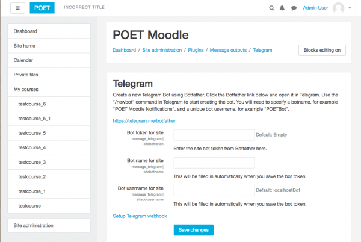

2. Click the link to open [@BotFather](https://t.me/BotFather) in Telegram:

   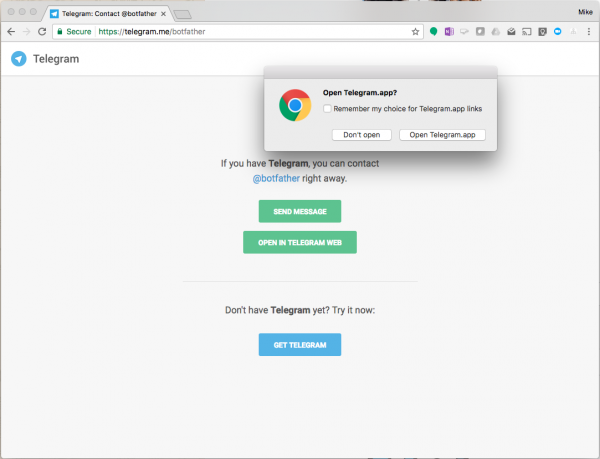

3. In Telegram, click the **Start** button at the bottom of the chat to begin your conversation with BotFather:

   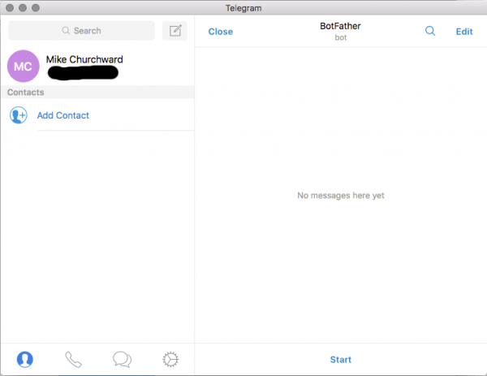

4. Send the command `/newbot` in the chat. BotFather will prompt you for:
   - A friendly **Display Name** for your bot (e.g., `SmartLearn LMS Alerts`).
   - A unique **Username** ending in `bot` (e.g., `smartlearn_alerts_bot`).

   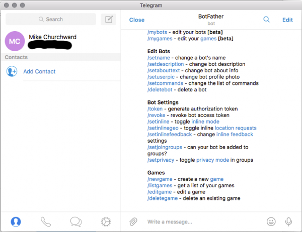

5. Once created, BotFather will display your **HTTP API Token**:

   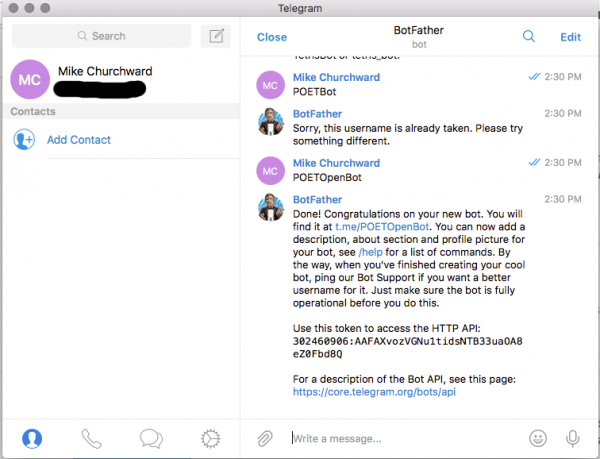

   > ⚠️ **Keep this token secret.** Anyone with this token can send messages on behalf of your bot.

---

### Step 2: Configure the Plugin in Moodle

#### 2.1 Enable the Telegram Message Output
> ℹ️ **Important:** Moodle hides message plugin settings until the plugin is enabled in the message outputs manager.
1. Navigate to **Site Administration > Plugins > Message outputs > Manage message outputs** (`/admin/message.php`).
2. Locate **Telegram** in the list and ensure the eye icon is **open / enabled**.

#### 2.2 Enter the Bot Token in Moodle Settings
1. Go to **Site Administration > Plugins > Message outputs > Telegram** (`/admin/settings.php?section=messagesettingtelegram`).
2. Paste your API token into the **Bot token for site** field and click **Save changes**:

   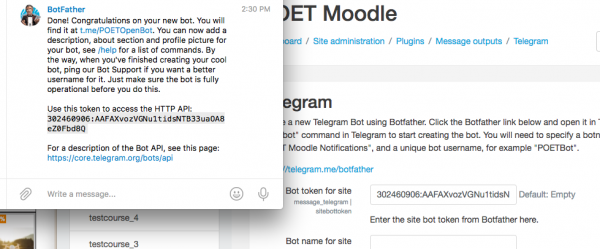

3. Moodle will contact Telegram and automatically fill in the **Bot name for site** and **Bot username for site**:

   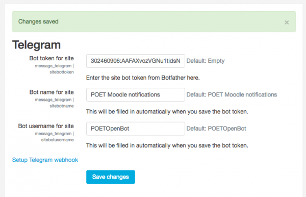

#### 2.3 (Optional) Configure Required Custom Profile Field for Phone
If you wish to allow automatic phone matching:
1. Navigate to **Site Administration > Users > User profile fields** (`/admin/user/profile/index.php`).
2. Click **Create a new profile field** and choose **Text input**.
3. Set **Short name** to `telegram` (or `telegram_phone`), check **Is this field required?** as **Yes**, and check **Display on signup page?** as **Yes**.
4. Return to **Site Administration > Plugins > Message outputs > Telegram**, select your field under **Custom profile field for Telegram phone**, and save changes.

#### 2.4 Configure Default Message Routing
1. Go to **Site Administration > Plugins > Message outputs > Default message outputs** (`/admin/message.php`).
2. Under the **Telegram** column, configure the notification events (Assignments, Forums, Grades, etc.) as **Permitted** and **Default enabled (Online / Offline)**.
3. Click **Save changes**.

#### 2.5 Ensure Moodle Cron is Running
The plugin processes bot updates and dispatches notifications via Moodle's background task system. Ensure Moodle cron is active:
```bash
php admin/cli/cron.php
```

---

## 📱 Step 3: Connecting User Accounts to Telegram

Users can connect their Moodle account to Telegram using any of the following 3 convenient methods:

---

### Method 1: The One-Click Connection Link (Classic Moodle Docs Way)

1. In Moodle, click your user avatar in the top-right corner and select **Preferences > Notification preferences**.
2. Locate the **Telegram** column (showing an alert indicating it is not yet configured) and click the gear/settings icon:

   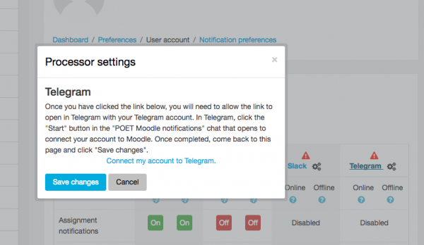

3. In the popup dialogue, click the **Connect with Telegram** link:

   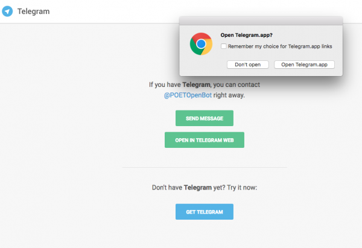

4. Telegram will open to your site's bot. Click the **Start** button at the bottom of the chat:

   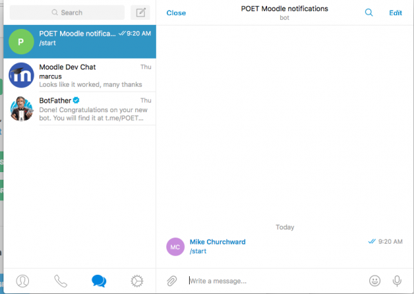

5. Return to your Moodle browser window/tab and click **Save changes**:

   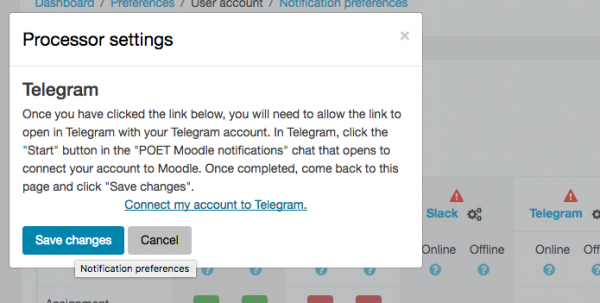

6. The alert icon is gone, and the connection is active! You can now customize your notification preferences:

   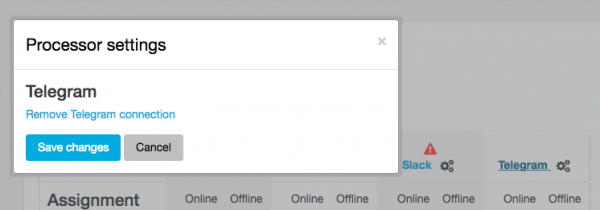

---

### Method 2: Automatic Phone Number Matching (Zero Codes)

1. The student enters their phone number in their Moodle profile under the custom profile field (during signup or under **Edit profile**).
2. In Telegram, the student searches for your bot (`@your_bot_name`) and sends `/start`.
3. The bot automatically replies with an interactive button:
   ```text
   📱 [ Share Phone Number to Connect ]
   ```
4. The student taps the button to share their contact.
5. Moodle matches the phone number with their custom profile field and immediately links their account!
   ```text
   ✅ Welcome [Student Name]! Your Telegram account has been linked to [Site Name].
   ```

---

### Method 3: Direct Telegram Chat ID Entry

If a student cannot share their phone number or prefers manual configuration:
1. In Telegram, open [@idbot](https://t.me/idbot) or [@userinfobot](https://t.me/userinfobot) and send `/start` to view your numeric Telegram ID (e.g. `123456789`).
2. In Moodle **Notification preferences > Telegram settings**, enter the ID into **Or enter Telegram Chat ID manually**:
   ```text
   123456789
   ```
3. Click **Save changes**. The account is linked immediately.

---

### How to Disconnect an Account:
1. Go to **Preferences > Notification preferences > Telegram settings**.
2. Click the **Disconnect Telegram** button.
3. The user's Telegram Chat ID will be removed immediately and notifications will cease.

---

## 🛠️ Troubleshooting & FAQ

### 1. "The Telegram bot has not been configured by the site administrator"
- **Cause:** The bot token has not been configured or is invalid.
- **Solution:** Verify the token in **Site Administration > Plugins > Message outputs > Telegram** matches the token provided by BotFather.

### 2. Notifications are not being received on Telegram
- **Check Connection Status:** In **Preferences > Notification preferences > Telegram settings**, verify the account status displays `Connected as: <Chat ID>`.
- **Check Notification Preferences:** In **Preferences > Notification preferences**, confirm that the checkboxes under the **Telegram** column are checked for the specific events.
- **Check Moodle Cron:** Notifications are dispatched via background queues. Ensure Moodle cron is running:
  ```bash
  php admin/cli/cron.php
  ```
- **Check Development Mode (`->noemailever`):** If testing on a development server, verify whether `->noemailever = true;` is present in `config.php`. This Moodle setting halts all outbound messaging.

### 3. Telegram bot takes up to a minute to respond or link
- Updates from Telegram are processed by Moodle's scheduled task `\message_telegram	ask\poll_updates`. Ensure Moodle cron is executing regularly (`php admin/cli/cron.php`).

---

## 🔒 Privacy & GDPR Compliance
This plugin is fully compliant with Moodle's Privacy Subsystem:
- **User Preferences:** Stores the user's Telegram Chat ID in the core `user_preferences` table (`message_processor_telegram_chatid`).
- **External Data Transmission:** Transmits notification content (subject, message body, context URL) and the recipient's Chat ID to Telegram's official API servers (`https://api.telegram.org`).
- **Data Export & Erasure:** Fully implements `\core_privacy\local\metadata
ull_provider` / user preference export and deletion handlers.

---

## 📄 License
This plugin is free software released under the [GNU General Public License v3.0 or later](https://www.gnu.org/licenses/gpl-3.0.html).

Created by **Mike Churchward** (2017)  
Modernized and Maintained by **Mohammad Nabil** (2025 onwards)
